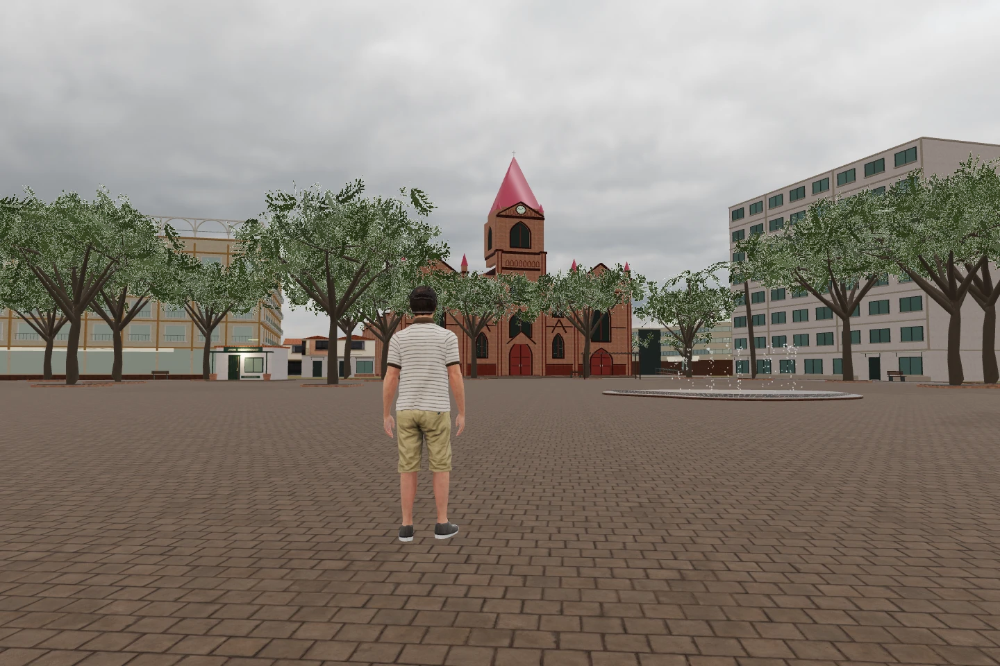

# Neiva Abierta

**Desarrollo actual: Unreal Engine 5.5.4.** La distribución oficial de Linux
está instalada; el proyecto C++ compila y la importación de activos pasó sus
comprobaciones. La partida de desarrollo cargó 35.873/35.873 edificios bajo
Xvfb, con Vulkan SM6 y una NVIDIA RTX 4050 Laptop. Se comprobó vídeo real
mediante Pixel Streaming con VP8, además de entrar, conducir, frenar y salir
del coche. La prueba recibió unos 30 FPS a 1280 × 720 durante 18,56 segundos;
es una medición breve del vídeo recibido, no del rendimiento máximo del motor.
El paquete Linux descargable está en construcción y todavía no está validado.
[Construcción, transmisión y publicación](docs/DISTRIBUCION.md) ·
[Proyecto Unreal](docs/UNREAL.md) ·
[Revisar referencias sin usar el teclado o mouse del escritorio](docs/NAVEGACION-AISLADA.md).

## Prototipo web anterior 0.4 · Three.js

La descripción, captura, controles y mediciones web siguientes corresponden
al prototipo Three.js 0.4. Sus pruebas no acreditan el ejecutable Unreal.

Una interpretación jugable de Neiva, Huila, Colombia. Acceso gratuito, personaje
sin nombre, caminata en tercera persona, un carro conducible, tráfico ambiental,
mapa con destinos y un pequeño estudio ficticio para contactar a Jhon Steven
Álvarez Ruiz. Controles de teclado y controles táctiles para celular.

[Jugar al prototipo web anterior](https://neiva-abierta.vercel.app/) ·
[Sala de juegos y Bloquitos](https://jhonstevenalvarezruiz.vercel.app/juegos/)



## Alcance del prototipo web 0.4

La edición web usa Three.js/WebGL 2 y funciona como sitio estático en Vercel.
Las calles, parques y huellas de edificios proceden de datos abiertos. Las
alturas ausentes, fachadas y árboles son una interpretación visual. La edición
0.4 usa un personaje humano animado de Microsoft Rocketbox, el automóvil
Car Concept de Khronos, mapas PBR fotográficos de Poly Haven, iluminación HDR,
sombras solares y fachadas de apariencia fotográfica generadas con IA. La
Catedral de la Inmaculada Concepción tiene una malla arquitectónica específica
con arcos, torre, reloj y cubiertas. El Palacio de Justicia, el Hotel Neiva Plaza
y el Templo Colonial tienen modelos específicos apoyados en referencias del
centro; el Santander incorpora pavimento, fuente de mosaico y vegetación densa.
La [revisión de fidelidad](docs/FIDELIDAD.md) registra las fuentes y los detalles
todavía estimados. Se corrigieron dos extrusiones residenciales sin respaldo
dentro del parque y el material de Calle 7 en su borde sur. El resto de edificios
conserva huellas cartográficas y recibe fachadas, aleros y tejados representativos.
La edición 0.4 corrige 22 cubiertas abiertas que se interpretaban como edificios
cerrados (14 asociadas a gasolineras); conserva sus huellas y estima los soportes.
Se repara además una huella cuyo redondeo había introducido un autocruce.
El suelo del juego es plano. No es una réplica
fotográfica ni un levantamiento completo de cada barrio e interior de Neiva.
El estudio mide 6 × 4 × 3,5 metros de juego y no representa una dirección real.

El desarrollo nativo usa Unreal Engine 5.5.4, con Lumen, ciudad procedural,
personaje, vehículo e interacción. Se comprobaron compilación, importación,
conducción y recepción de vídeo VP8 de la partida de desarrollo. La entrega
empaquetada y su ejecución independiente siguen pendientes. Los controles y la
captura de esta sección pertenecen al prototipo web.
[Estado y límites de Unreal](docs/UNREAL.md).

Google Photorealistic 3D Tiles puede conectarse mediante Cesium para Unreal.
Se incluye una preparación opcional que requiere plugin, clave API, facturación
y verificar la cobertura real de Neiva. No se han extraído imágenes, mallas ni
fachadas de Google Maps/Street View; los datos de Google no se redistribuyen
bajo la licencia del juego. Publicar Unreal interactivo en navegador requiere
además un servidor GPU y Pixel Streaming; Vercel aloja la edición web.

## Controles del prototipo web 0.4

| Acción | Computador | Celular |
| --- | --- | --- |
| Caminar / conducir | WASD o flechas | Palanca izquierda |
| Mirar | Mover el mouse, sin mantener clic | Deslizar sobre la ciudad |
| Correr | Mantener Shift | Tocar Correr para activar/desactivar |
| Observar un lugar, subir / bajar del carro, visitar estudio | E o botón contextual | E |
| Frenar carro | Espacio | Mantener Freno |
| Mapa, guía y viaje directo | M o Mapa | Mapa |
| Medidas y fuente del edificio que miras | I | Ver edificio (⌕) |
| Pausar / continuar | Esc o menú | Menú |
| Sensibilidad | C o ajustes | Ajustes |
| Pantalla completa | F | Ajustes, cuando el navegador lo admita |

Entrar a la ciudad solicita la captura del mouse mediante Pointer Lock. Escape
suelta el cursor y pausa; continuar vuelve a capturarlo con un gesto del usuario.
Los diálogos también liberan el mouse. Si el navegador deniega la captura, la
cámara sigue el mouse sobre el canvas sin arrastrar, y un clic reintenta la captura.

El carro dorado es conducible. Los demás vehículos son tráfico ambiental de
recorrido simple; no son una simulación vial completa. Los edificios tienen
colisión de huella; las cubiertas abiertas bloquean sólo sus soportes estimados; el estudio abre un panel de servicios. Las demás fachadas
no tienen interiores. El botón Inicio recupera una posición transitable.

Hay tres luces del día, ambiente seco o después de lluvia (tecla L), reflejos
locales en charcos, calidad gráfica ajustable y descarga de una foto del
recorrido. Elegir un destino activa una guía de dirección y distancia en línea recta.
Observar una parada exige acercarse a pie y pulsar E; pasar cerca ya no suma
visitas. La acción Viajar del mapa sigue ofreciendo traslado directo. El
inspector I muestra área y dimensiones de la huella, procedencia y altura
representada, identificando las estimaciones. Su enlace a Street View abre
Google Maps para comparar la referencia disponible, sin incorporarla al juego.
Las observaciones se guardan sólo en localStorage del dispositivo (clave v2);
si ese almacenamiento no está disponible, se puede seguir jugando. Cambiar de
pestaña limpia las entradas y pausa el juego. No hay cuentas ni multijugador.

## Desarrollo del prototipo web

Node.js 24, npm y un navegador WebGL 2.

```sh
npm ci
npm test
npm run build
npm run dev
```

Abre `http://localhost:4173`. La compilación genera `dist/` y no depende de CDN,
claves ni peticiones externas durante la partida. Las dependencias están fijadas
en `package-lock.json`. `npm run data` actualiza la cartografía: requiere red y
respeta los límites del proveedor. Consulta el pipeline y las fechas en
[MAPAS.md](docs/MAPAS.md). Los datos se sirven con la aplicación y se pueden
descargar dentro del juego.

## Modelo, rendimiento y verificación del prototipo web

Coordenadas locales en metros, X este y Z sur, con origen geográfico declarado
en `public/data/neiva.json`. La proyección equirectangular es una aproximación
local; la precisión posicional de las huellas y alturas estimadas es desconocida.
El juego conserva IDs y procedencia para consultar y sustituir datos.

La velocidad a pie es 2 m/s y al correr 5,4 m/s; las animaciones de espera,
caminata y carrera se mezclan según el desplazamiento efectivo. El carro limita avance a
20 m/s y reversa a 4,5 m/s, con dirección gradual y frenada de 10 m/s². Son parámetros de juego, no medidas del tráfico real.
Las colisiones se consultan con índice espacial y el movimiento se subdivide
cada 0,35 m para impedir atravesar una pared por un salto temporal. La simulación usa pasos fijos de 1/60 s e interpola las posiciones al dibujar.
Elimina el antiguo límite de 50 ms por cuadro, que ralentizaba el desplazamiento
por debajo de 20 FPS. Un cuadro puede procesar 120 pasos; un exceso queda como
tiempo pendiente y se muestra en el diagnóstico, sin descartarlo. La pausa y
la pérdida de foco reinician el reloj. [Dinámicas y pruebas](docs/JUGABILIDAD.md).

La geometría está agrupada por celdas y material. La edición 0.4 limita el
detalle y las sombras por distancia, conserva matrices de elementos estáticos
y adapta la resolución en Auto según intervalos reales entre cuadros. Los
reflejos usan una captura local y los menús se dibujan hasta 15 veces por
segundo sin contar esa pausa como lentitud de GPU. El minimapa cachea hasta
16 mosaicos (4 MiB de píxeles) y el atlas se dibuja una vez por tamaño. La vía
más cercana se resuelve mediante un índice exacto de segmentos.
[Rendimiento medido y límites](docs/RENDIMIENTO.md). Tiempo y memoria de carga
O(V), para V vértices; consultas de colisión O(K·P), K polígonos locales y P
vértices medios. Las pruebas incluyen paredes delgadas a alta velocidad,
patios, salida obstruida del carro, proyección y validez del mapa. El rendimiento
real depende de GPU, resolución y cobertura visible; no se afirma una tasa de
fotogramas sin medición en el dispositivo.

[Actores y licencias](docs/ACTORES.md) · [Materiales](docs/MATERIALES.md) ·
[Fachadas generadas y prompts](docs/FACHADAS-GENERADAS.md) ·
[Catedral](docs/LUGARES-MODELADOS.md) · [Revisión del centro](docs/FIDELIDAD.md) ·
[Clima y reflejos](docs/CLIMA.md).

Umbral funcional: cero errores JavaScript, movimiento comprobable, entrada/salida
del vehículo, panel de contacto accesible y cero desbordamiento horizontal a
320/390 px. Las comprobaciones de navegador se ejecutan con
`HEADLESS=1 node scripts/check-browser.mjs` contra un servidor local (Chrome
con GPU habilitada). Consulte el resultado
de la ejecución en la entrega; Unreal requiere su validación independiente.

## Licencias y fuentes

Código original: [MIT](LICENSE). Three.js: MIT. Unreal Engine conserva la
licencia de Epic y no está incluido. Datos y atribuciones: [MAPAS.md](docs/MAPAS.md).
Personaje Microsoft Rocketbox: MIT; automóvil Car Concept de Eric Chadwick,
Darmstadt Graphics Group GmbH, 2024: CC BY 4.0, con sus condiciones de marcas
conservadas. Materiales y HDR de Poly Haven: CC0. Atribuciones también disponibles
dentro del juego, en Sobre este mundo. El código abierto del juego no cambia
la licencia de los proveedores externos.
